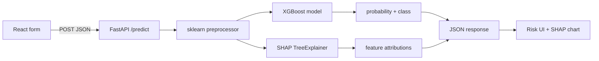

# MedRisk AI

**Heart disease risk prediction with explainable machine learning.**

MedRisk AI is a full-stack clinical decision-support tool that estimates the likelihood of heart disease from standard patient vitals and cardiac indicators. Each assessment returns a calibrated risk probability and SHAP-based explanations so clinicians and patients can see which factors drove the prediction.

> **Disclaimer:** For clinical decision support and education only. Not a substitute for professional diagnosis or treatment.

---

## Project overview

Users enter eleven clinical features (age, sex, chest pain type, resting blood pressure, cholesterol, fasting blood sugar, resting ECG, max heart rate, exercise angina, ST depression, and ST slope). The backend preprocesses the input, runs an XGBoost classifier trained on a heart-disease dataset, and returns:

- A **binary risk label** (low / high)
- A **probability score** for the positive class
- **Per-feature SHAP values** visualized in the UI as the top drivers of that specific prediction

The frontend is a responsive React application; the API is a lightweight FastAPI service with serialized model artifacts loaded at startup.

---

## Live demo

| Service   | URL |
|-----------|-----|
| **App**   | [https://medrisk-ai-three.vercel.app/](https://medrisk-ai-three.vercel.app/) |
| **API**   | [https://medrisk-ai-backend.onrender.com/](https://medrisk-ai-backend.onrender.com/) |

The production frontend calls `POST /predict` on the Render-hosted backend. The API root (`GET /`) returns a simple health check: `{"status": "MedRisk AI is running"}`.

---

## Tech stack

| Layer        | Technologies |
|--------------|--------------|
| **ML**       | XGBoost, scikit-learn (preprocessing pipeline), SHAP (`TreeExplainer`) |
| **Backend**  | FastAPI, Uvicorn, Pandas, NumPy — deployed on **Render** |
| **Frontend** | React 19, Create React App — deployed on **Vercel** |
| **Data**     | Tabular heart-disease dataset (`backend/data/heart.csv`) |

---

## How it works



1. **Input** — The React app collects eleven fields and sends them as JSON to `/predict`.
2. **Preprocessing** — A fitted `ColumnTransformer` imputes missing numeric values (median) and categoricals (mode), scales numerics with `StandardScaler`, and one-hot encodes categorical columns.
3. **Inference** — The XGBoost model outputs `predict_proba`; predictions use a 0.5 threshold on the positive class.
4. **Explainability** — `shap.TreeExplainer` computes SHAP values for the processed feature vector; the frontend ranks and displays the top eight contributors.
5. **Response** — Example shape:

   ```json
   {
     "prediction": 0,
     "probability": 0.2341,
     "shap_values": [0.12, -0.05, ...]
   }
   ```

---

## Key ML decisions

- **Dataset hygiene** — Resting blood pressure and cholesterol values of `0` are treated as missing (invalid clinical readings) and imputed rather than kept as zeros.
- **Preprocessing pipeline** — Numeric and categorical columns are handled in separate sklearn pipelines, then combined with `ColumnTransformer` so training and inference stay aligned.
- **Model selection** — Logistic regression, random forest, and XGBoost were compared on a stratified 80/20 holdout (classification report + ROC-AUC). **5-fold stratified cross-validation** (ROC-AUC) was used to assess stability across folds.
- **Production model** — **XGBoost** was chosen for deployment after strong, consistent cross-validated performance (random forest showed competitive holdout metrics; XGBoost was preferred for consistency across CV folds).
- **Explainability** — SHAP values from a tree explainer are computed on every prediction so explanations are local to the patient case, not only global feature importance from training.
- **Artifacts** — The trained estimator and preprocessor are pickled to `backend/models/` and loaded once when the API starts.

Re-train or refresh artifacts by running `python model.py` from the `backend/` directory (requires `data/heart.csv` and will overwrite `models/xgb_model.pkl` and `models/preprocessor.pkl`).

---

## Repository structure

```
medrisk-ai/
├── backend/
│   ├── main.py              # FastAPI app and /predict endpoint
│   ├── model.py             # Training, evaluation, and artifact export
│   ├── data/heart.csv       # Training data
│   ├── models/              # Serialized model and preprocessor
│   ├── notebooks/eda.ipynb  # Exploratory analysis
│   └── requirements.txt
└── frontend/
    ├── src/App.js           # Assessment form and results UI
    ├── src/ShapFeatureChart.js
    └── package.json
```

---

## Local setup

### Prerequisites

- **Node.js** 18+ and npm (frontend)
- **Python** 3.10+ (backend)
- Trained artifacts in `backend/models/` (`xgb_model.pkl`, `preprocessor.pkl`). If missing, run the training script below first.

### Backend

```bash
cd backend
python -m venv venv
source venv/bin/activate   # Windows: venv\Scripts\activate
pip install -r requirements.txt

# Optional: train model and save pickles (requires data/heart.csv)
python model.py

uvicorn main:app --reload --host 127.0.0.1 --port 8000
```

API docs: [http://127.0.0.1:8000/docs](http://127.0.0.1:8000/docs)

### Frontend

```bash
cd frontend
npm install
npm start
```

Open [http://localhost:3000](http://localhost:3000).

**Point the UI at your local API:** In `frontend/src/App.js`, set `API_URL` to `http://127.0.0.1:8000/predict` while developing. The committed default targets the Render production backend so the Vercel deployment works without extra configuration.

### Quick API test

```bash
curl -X POST http://127.0.0.1:8000/predict \
  -H "Content-Type: application/json" \
  -d '{
    "Age": 55,
    "Sex": "M",
    "ChestPainType": "ASY",
    "RestingBP": 140,
    "Cholesterol": 220,
    "FastingBS": 0,
    "RestingECG": "Normal",
    "MaxHR": 150,
    "ExerciseAngina": "N",
    "Oldpeak": 1.0,
    "ST_Slope": "Up"
  }'
```

### Production builds

- **Frontend:** `npm run build` from `frontend/` (static output in `frontend/build/`, suitable for Vercel)
- **Backend:** Deploy with Uvicorn (`uvicorn main:app --host 0.0.0.0 --port $PORT`) on Render; ensure `models/` and dependencies are included in the deploy context
